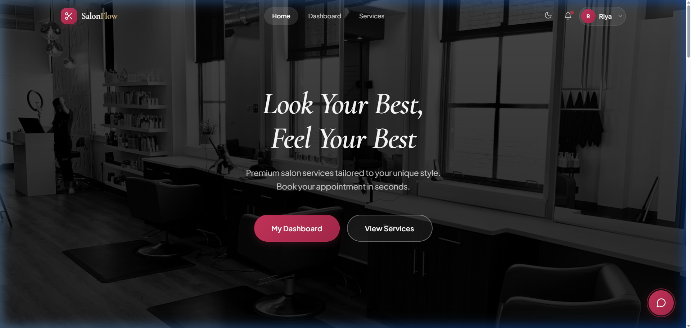
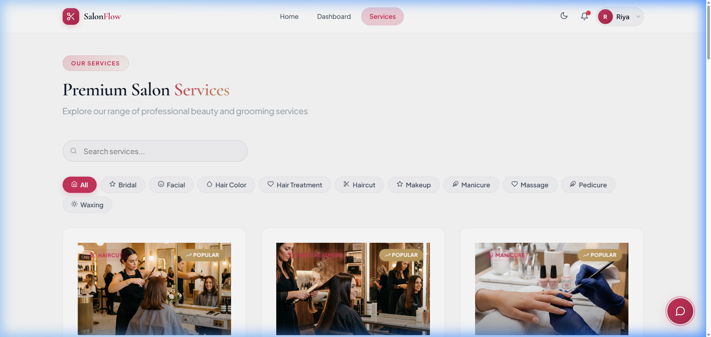
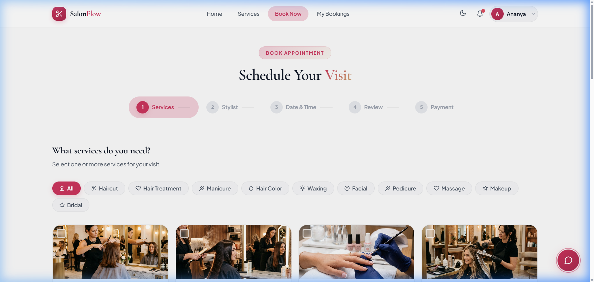
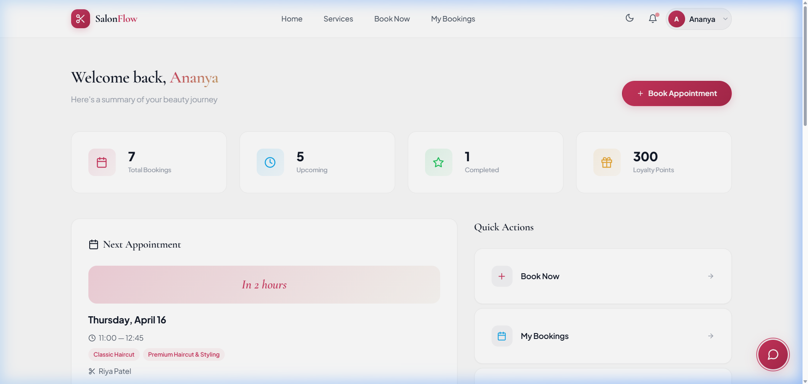
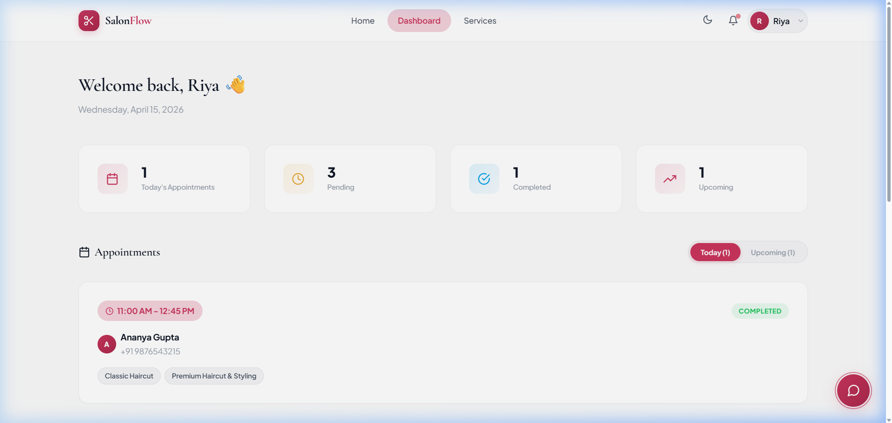
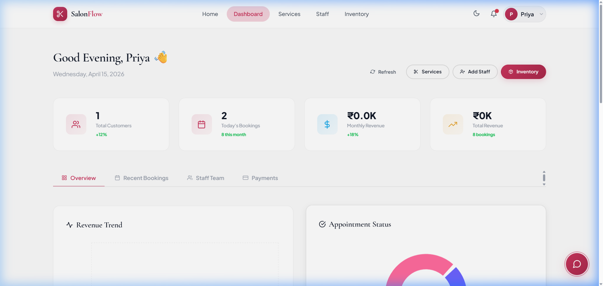
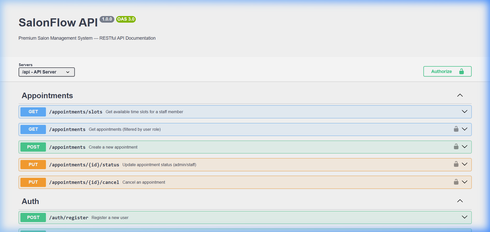

# ✂️ SalonFlow — Premium Salon Management System

<div align="center">


**A production-ready, full-stack salon management platform with online booking, Razorpay payments, AI chatbot, real-time notifications, and a premium dark-themed UI.**

[Live Demo](#) · [API Docs](#-api-documentation) · [Screenshots](#-screenshots) · [Getting Started](#-getting-started)

</div>

---

## 📸 Screenshots

### 🏠 Home Page
Premium landing page with full-width hero, salon imagery, and elegant typography.



---

### 💈 Services Catalog
Filterable service catalog with category pills, search, pricing, and booking CTAs.



---

### 📅 Booking Wizard
5-step multi-step booking flow: Select Services → Choose Stylist → Pick Date/Time → Review → Pay.



---

### 👤 Customer Dashboard
Customer view with upcoming appointments, booking history, and personalized recommendations.



---

### 👩‍💼 Staff Dashboard
Staff-specific view showing assigned appointments with Confirm/Start/No Show action buttons. Each staff member only sees their own bookings.



---

### 📊 Admin Dashboard
Admin analytics with revenue trends, booking stats, staff performance, and team management.



---

### 📖 Swagger API Docs
Interactive OpenAPI 3.0 documentation with all endpoints — accessible at `/api-docs`.



---

## 🌟 Features

### For Customers
- 🗓️ **Multi-step Booking Wizard** — Select services → Choose stylist → Pick date/time → Review → Pay
- 💳 **Razorpay Payment Gateway** — Secure online payments with HMAC SHA256 signature verification
- 📊 **Customer Dashboard** — View upcoming appointments, booking history, and loyalty points
- 🔔 **Real-time Notifications** — Instant updates via Socket.IO when bookings are confirmed/cancelled
- 🤖 **AI Chatbot** — Google Gemini-powered assistant for salon queries and recommendations
- 🌙 **Dark/Light Theme** — Premium UI with glassmorphism, gradients, and micro-animations

### For Salon Owners (Admin)
- 📈 **Analytics Dashboard** — Revenue trends, booking stats, staff performance (Recharts)
- 👥 **Staff Management** — Add/edit staff, assign specializations, manage working hours
- 📦 **Inventory Tracking** — Stock management with low-stock alerts and restock history
- 🛎️ **Service Management** — Full CRUD with categories, pricing, image uploads, and popularity tracking
- 💰 **Payment History** — Complete transaction records with invoice auto-generation

### For Staff
- 📋 **Staff Dashboard** — View only your assigned appointments, update status, track completions
- ⏰ **Appointment Actions** — Confirm, Start, Mark Complete, or No Show
- 🔒 **Privacy** — Staff can only see and manage their own bookings

---

## 🏗️ Tech Stack

| Layer | Technology |
|-------|-----------|
| **Frontend** | React 18, React Router 6, Recharts, React Icons (Feather), Vite 5 |
| **Backend** | Node.js, Express 4, Socket.IO, Winston Logger |
| **Database** | MongoDB Atlas, Mongoose 8 (with optimized indexes) |
| **Payments** | Razorpay (Orders + Signature Verification + Webhooks) |
| **AI** | Google Gemini Generative AI |
| **Auth** | JWT (Bearer Token) with role-based access control (RBAC) |
| **Email** | Nodemailer + Agenda (background job queue with retry) |
| **Security** | Helmet, CORS, Rate Limiting, bcrypt-12, NoSQL Injection Prevention |
| **Testing** | Jest, Supertest, MongoDB Memory Server |
| **Docs** | Swagger / OpenAPI 3.0 |
| **CI/CD** | GitHub Actions |
| **PWA** | Service Worker, Web App Manifest |
| **i18n** | English + Hindi (extensible) |

---

## 🔐 Security Features

- ✅ **Helmet.js** with custom Content Security Policy
- ✅ **Rate Limiting** — 200 req/15min (API), 20 req/15min (Auth)
- ✅ **Password Hashing** — bcrypt with 12 salt rounds
- ✅ **JWT Rotation** — Graceful secret rotation with fallback support
- ✅ **HTTPS Enforcement** — Automatic redirect + HSTS headers in production
- ✅ **Socket.IO Authentication** — JWT-verified WebSocket connections
- ✅ **Razorpay Webhook Verification** — HMAC SHA256 signature validation
- ✅ **NoSQL Injection Prevention** — Query sanitization middleware
- ✅ **Input Validation** — express-validator on all critical endpoints
- ✅ **Account Lockout** — Brute-force protection with login attempt tracking

---

## 🚀 Getting Started

### Prerequisites
- **Node.js** 18+ and npm
- **MongoDB** (Atlas recommended) or local MongoDB instance
- **Razorpay** account (test mode for development)

### 1. Clone the Repository
```bash
git clone https://github.com/tapendra9104/parlor-management-system.git
cd parlor-management-system
```

### 2. Setup Backend
```bash
cd server
cp .env.example .env    # Edit with your credentials
npm install
npm run dev             # Starts on http://localhost:5000
```

### 3. Setup Frontend
```bash
cd client
npm install
npm run dev             # Starts on http://localhost:5173
```

### 4. Seed Demo Data (Optional)
```bash
cd server
node seed.js
```

This creates demo accounts and sample appointments for all staff members.

### 5. Environment Variables

```env
# Required
MONGODB_URI=mongodb+srv://...
JWT_SECRET=your-secret-min-32-chars

# Razorpay
RAZORPAY_KEY_ID=rzp_test_xxxxx
RAZORPAY_KEY_SECRET=xxxxx

# Optional
GEMINI_API_KEY=your-gemini-key
EMAIL_USER=your-email@gmail.com
EMAIL_PASS=your-app-password
```

> 💡 Generate a secure JWT secret: `npm run generate-secret`

---

## 🧰 Demo Accounts

| Role | Email | Password |
|------|-------|----------|
| 👑 Admin | admin@salonflow.com | admin123 |
| 💇 Staff (Riya) | riya@salonflow.com | staff123 |
| 💇 Staff (Amit) | amit@salonflow.com | staff123 |
| 👤 Customer | customer@salonflow.com | customer123 |

---

## 📖 API Documentation

Interactive API docs available at **`/api-docs`** (Swagger UI) when the server is running.

### Key Endpoints

| Method | Endpoint | Description | Auth |
|--------|----------|-------------|------|
| `POST` | `/api/auth/register` | Register new user | Public |
| `POST` | `/api/auth/login` | Login | Public |
| `GET` | `/api/services` | List services (paginated) | Public |
| `POST` | `/api/appointments` | Create booking | Customer |
| `GET` | `/api/appointments/slots` | Check availability | Public |
| `PUT` | `/api/appointments/:id/status` | Confirm/reject appointment | Staff/Admin |
| `POST` | `/api/payments/create-order` | Create Razorpay order | Customer |
| `POST` | `/api/payments/verify` | Verify payment signature | Customer |
| `POST` | `/api/webhooks/razorpay` | Razorpay webhook | Webhook |
| `GET` | `/api/analytics/dashboard` | Dashboard analytics | Admin |

---

## 🧪 Testing

```bash
cd server
npm test              # Run all tests
npm run test:watch    # Watch mode
```

**Test Coverage:**
- ✅ Auth API (register, login, profile, guards)
- ✅ Service API (CRUD, RBAC, filtering)
- ✅ Appointment API (booking, conflicts, slots)
- ✅ Payment API (keys, signatures, invoicing)

---

## 📁 Project Structure

```
salonflow/
├── client/                    # React Frontend (Vite)
│   ├── public/
│   │   ├── images/            # Service images
│   │   ├── manifest.json      # PWA manifest
│   │   └── sw.js              # Service worker
│   └── src/
│       ├── components/        # Reusable UI components
│       │   ├── Chatbot/       # AI ChatWidget
│       │   └── Layout/        # Navbar, Footer
│       ├── context/           # Auth, Theme contexts
│       ├── i18n/              # Translations (en, hi)
│       ├── pages/             # Page components
│       │   ├── Admin/         # Admin dashboard
│       │   ├── Auth/          # Login, Register
│       │   ├── Booking/       # Multi-step wizard
│       │   ├── Customer/      # Customer dashboard
│       │   ├── Home/          # Landing page
│       │   ├── Services/      # Service catalog
│       │   └── Staff/         # Staff dashboard
│       └── services/          # API service layer
│
├── server/                    # Express Backend
│   ├── config/                # DB, env, logger, swagger, secrets
│   ├── controllers/           # Route handlers (11 controllers)
│   ├── jobs/                  # Email queue (Agenda)
│   ├── middleware/            # Auth, validation, upload, pagination
│   ├── models/                # Mongoose schemas (9 models)
│   ├── routes/                # API routes with Swagger docs
│   ├── scripts/               # Backup automation
│   ├── services/              # Email, AI services
│   ├── tests/                 # Jest test suites (30+ tests)
│   └── server.js              # Entry point
│
├── screenshots/               # App screenshots for README
├── .github/workflows/         # CI/CD pipeline
├── BACKUP_STRATEGY.md         # Disaster recovery guide
└── README.md
```

---

## 🌐 Internationalization (i18n)

SalonFlow supports multiple languages:
- 🇬🇧 **English** (default)
- 🇮🇳 **Hindi** (हिंदी)

Add new languages by creating a translation file in `client/src/i18n/`.

---

## 📱 PWA Support

SalonFlow is installable as a Progressive Web App:
- ✅ Works offline (cached static assets)
- ✅ Add to home screen on mobile
- ✅ App-like experience with standalone display

---

## 🔄 Deployment

### Production Checklist
- [ ] Set `NODE_ENV=production`
- [ ] Set `VITE_DEMO_MODE=false`
- [ ] Use strong `JWT_SECRET` (64+ chars)
- [ ] Configure Razorpay webhook URL
- [ ] Enable MongoDB Atlas backups
- [ ] Setup monitoring (Sentry/LogRocket)

### Recommended Hosting
| Component | Platform |
|-----------|----------|
| Backend | Render, Railway, or AWS EC2 |
| Frontend | Vercel or Netlify |
| Database | MongoDB Atlas (M10+ for production) |

---

## 🤝 Contributing

1. Fork the repository
2. Create your feature branch (`git checkout -b feature/amazing-feature`)
3. Commit your changes (`git commit -m 'Add amazing feature'`)
4. Push to the branch (`git push origin feature/amazing-feature`)
5. Open a Pull Request

---

## 📄 License

This project is licensed under the MIT License.

---

<div align="center">

**Built with ❤️ for the beauty industry**

⭐ Star this repo if you found it useful!

</div>
